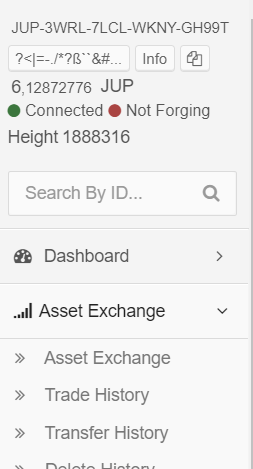
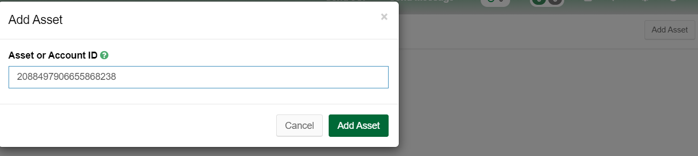
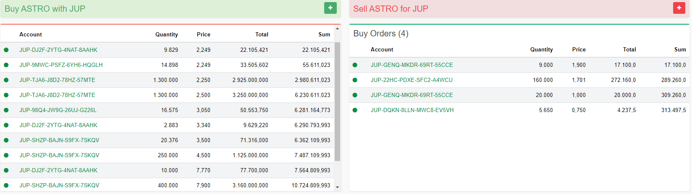

# ASTRO

Astro is another asset on the Jupiter Chain. It is part of a reward programm (like FORGE/node rewards) but has some differencies.

Content:

-  [Tokennomics of ASTRO](#tokennomics-of-astro)
- [Use Case of ASTRO](#use-case-of-astro)
- [How to buy and sell ASTRO](#how-to-buy-and-sell-astro)

### Tokennomics of ASTRO

- Supply: 19.114.911 ASTRO (fix)
- Asset-ID: 2088497906655868238

______________________________________________________________________________________________________________________________

### Use Case of ASTRO

ASTRO was introduced to have an Asset with higher risk but also better rewards than FORGE. There was an initial sell on the wallet-integrated JUP-DEX. The price started at 0.75JUP/ASTRO and increased when the sellorder was sold out. After 8 days, every unsold ASTRO-Token was burned to limit the supply.

Unlike FORGE, ASTRO will be traded on JUP-DEX, so that there is no guarantee, that you can sell your ASTRO 1:1 as you bought it - that is one of the risks. Another risks are for example:

- unknown how long rewards are paid
- unknown how long the rewards will stay on this level or if they will change in the future

So your APY with ASTRO is depending on several factors, mainly driven by the buy-price on the JUP-DEX. The rewards are paid hourly. All you need to do to is buy ASTRO and hold them. Currently, every hour 3.5k JUP are rewarded to ASTRO-Holders

____________________________________________

### How to buy and sell ASTRO

as mentioned, ASTRO can only be bought via the JUP-DEX inside the wallet.

So login on your local wallet or use an official team-wallet like [nodes.jup.io](nodes.jup.io), login with you account-address.

Then on the menu on the left, click asset exchange.

If you already bought other assets, they will be listed there, if not the page is empty. Click add asset in upper right corner and enter the ASTRO-ID 2088497906655868238 in the new window. Now click the green "add asset" and you will see Infos about ASTRO, Order-Books and Trade History.

To buy and sell, it is easy to remember which side of the orderbooks presents what

On the left side you can buy ASTRO and below that are the sell orders you can buy from. On the right side, you can sell ASTRO and below that are the buy orders.

Be aware all trading is done by users. There is no guarantee, that you can buy ASTRO to the price YOU want, nor that you can sell it.
