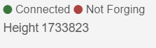
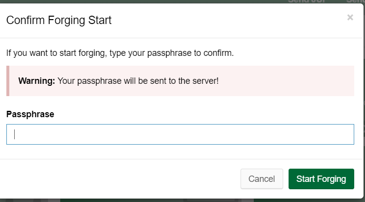
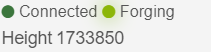
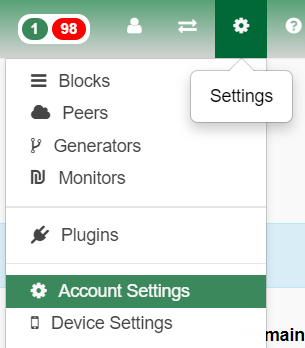
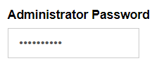
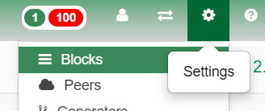
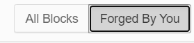
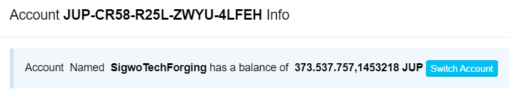

# forging and FORGE

Content:

[forging](#forging)

[FORGE](#FORGE)

[difference](#Difference)

### forging

As Jupiter is a PoS-Chain, forging is the equivalent to staking (compare to Blackcoin as the second coin after NXT that implemented 100% PoS without PoW). It means, that to take part on the process of the creation of new blocks, you have to have tokens and the more tokens you have, the bigger is your chance to create the next block.

As you are maybe used to other PoS-Coins, where the wallet automatically starts to take part on the process after it fits certain parameters (coinweight, coinage) on Jupiter you have to activate it actively.

The red dot with "Not Forging" determines, we are not trying to help the network by trying to generate blocks. It is possible that you face a grey dot instead of the red one with "unknown".

If you want to activate it, you need to:

- have a minimum of 1000 JUP
- need 1440 Confirmations on this 1000 JUP (with Blocktime of 25s around 10h)

So, minimum is 1000, the more, the better. For the 1440 Confirmations it can get a bit more complex, let's see an example:

- You have 900 Coins with 1500 Confirmations
- you have 200 Coins with 1000 Confirmations
- you have 500 Coins with 500 Confirmations

You already have an effective balance of 900 JUP, this is not enough for staking, the rest of your coins has not reached 1440 Confirmations, when your 200 Coins get 1440 Confirmations, you can activate forging, as you now have more than 1000. If the next 500 Coins get 1440 Confirmations, the simply add to your effective balance which means, you can hit a block earlier.

#### Start forging

If you now want to activate forging, click on the red Dot with "not Forging" or the grey one with "unknown".

It opens a window:

Here you have to enter your passphrase (the 12 words  with spaces). If you now click on Start Forging, you see a green dot with "forging".

Sidenote:

The green dot turns to grey "unknown" after the next try of the gui to retrieve the status. This happens if you have not set your admin password in the wallet-gui. The admin password is configured in the nxt.properties file (the config of your node).

You can enter it on the gui under Settings - Account Settings:

In the opening window, there is a field Administrator Password:

Enter the same password here, you configured under nxt.myPassword in nxt.properties file and then click any other window/link (Dashboard for example). The password is automatically saved and your Forging status should always reflect the right one (Not Forging or Forging).

Depending on your amount of Coins, you now have to wait :) Don't worry if you are not on the list of Generators. You need to hit 2 Blocks out of the last 10000, which again is bound to your "stake".

If you want to see, if and which block you created, go to "settings" and then "blocks"

in the opening window you see all the details about the latest blocks, including the generator. If you only want to see the blocks you created, on the upper right side, click "forged by you"

#### Notes

- if the node was restarted, you have to activate forging again
- there are certain API-calls around forging (Status, start, stop, lease)

_________________________________________________________________________________________________________________________________________________________________________________________________________________________________________________________________________________________________________________________________________________________________________________________________________________________

### FORGE

FORGE is an asset (just like an ERC-20 token on ETH) on the Jupiter chain. It was initiated by Sigwo to create a pool for JUP-Holders with smaller balances. There are as many FORGE as JUP (how to buy it, see [here](https://github.com/raetsch/Jupiter-Info-Collection/blob/main/forging_pool.md)).

The connection of FORGE to forging is, that you buy FORGE for JUP. With this buy your JUP is added to the JUP address Sigwo has created the FORGE asset with, and this address is actively forging. Everyone holding FORGE did this to "power up" Sigwos JUP-Address and so you can call it a pool.

You as a FORGE-Holder don't have to do anything, just wait for payouts.

#### reward structure

- currently, there is an amount of JUP reserved for FORGE-Owners as a replacement for the bwJUP-farm on value.defi. The payouts are hourly and the amount depends on your stake (in % of all FORGE-holders). This program should be lasting until the end of 2021. It currently is under rework. Updates will follow here
- formerly and most likely after the reward programm, the tx-rewards, that the forging node earned were/are paid out (again spreaded evenly, depending on your stake)

__________________________________________________________________________________________________________________________________________________________________________________________________________________________________________________________________________

### Difference

- forging is the active part to help the network by creating blocks
- FORGE is an asset that reflects a pool/farm with single side staking
- forging is supporting the network
- forging needs active activation and reactivation
- FORGE is completely passive after buying