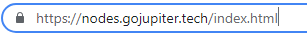
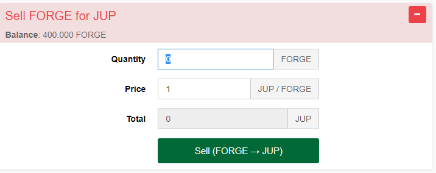

# Jupiter Earn Programm (FORGE)

This guide targets the process to be a part of the official sigwo forging pool. It is inspired by [this](https://blog.gojupiter.tech/how-to-earn-on-jupiter-2108413fd0ad) blogpost.

## Overview

Before we start with the guide, what IS forging?

Jupiter is a Proof-of-Stake (PoS) Blockchain and therefore needs nodes that have a balance they can use to be eligible to create blocks. The consensus algorithm decides who is "allowed" to create the next blocks. This node gets then all the tx-fees from this block as a reward for participating in the network. So this could be 0 JUP but also lot's of JUP.

Users that don't want to run a node or have a lower balance that is not enough to hit blocks very often need a chance to also participate in that process. This is were FORGE enters the Ring.

### Before we start

Remember, we are now talking about Mainnet. It is very likely, that you bought your JUP on Uniswap or Pancakeswap. You now have to swap them over to the mainnet with the [gateway](https://swap.jup.io).

If you need a guide: [here](https://github.com/raetsch/Jupiter-Info-Collection/blob/main/gateways.md) you are :)

### What is FORGE?

FORGE is an Asset on the Jupiter-Chain. Assets have IDs which make them unique, so first warning here:

**Everyone can create an asset called FORGE, but only the asset with the ID: 15210174725739850610 (confirm this in the official [blogpost](https://blog.gojupiter.tech/how-to-earn-on-jupiter-2108413fd0ad) to be sure) is usable to enter the Jupiter Earn Program**

So, were can you find it?

Go to your Jupiter Wallet (or Webwallet, for example [official webwallet](https://nodes.gojupiter.tech/index.html)) and click on asset exchange, then on "add asset". Enter the ID and click the green "add asset".

You should see now this:

What do we have here?

- 1.000.000.000 FORGE were created. 
- Exchange rate FORGE - JUP is 1:1 in both directions

### Buy FORGE

If you want to buy FORGE with your JUP, Click on the green "+". This opens the buy window, enter your amount and click "buy".

Another warning for security reasons:

**If you are <u>not</u> connected to a local wallet under your control (no, your VPS is also unsafe if you are not using tls-based encryption for the wallet), don't send your passphrase. It will be send over half the internet in clear text! Be sure that you use a wallet with encryption activated**

 

Now opens a normal transaction dialogue where you have to enter your passphrase (the 12 words - with spaces).

If you click on "Buy Asset" now, you get a short message on the upper right that your order was submitted. Now Click on forge again.

 

and you will see the buy order:

This will only take some seconds to a few minutes. When the bot bought your offer, it looks like this:

**That was everything you need to do. Now every Sunday (Evening - The Evening of Timezone UTC -5) you are rewarded with your share of the forged tx-fees.** 

### About the ROI/APY

It is not easy to calculate a ROI or APY as the block-rewards are tx-fees and so depend on the usage of the mainnet. We all expect a rise of the fees, when metis is launched and used. But no one can forsee this. So what can you do?

- Check your share of the forging pool.

  You can assume, that every bought FORGE is part of the Pool. So here in the guide, around 9 Million FORGE (check it every time you want to calculate the share)

- Look at the Block Explorer and the tracked wallets [here](https://jupitertoolkit.com/explorer/address/JUP-CR58-R25L-ZWYU-4LFEH). You can check the payouts there (scroll a bit to a sunday).

So there is no easy way yet, but you can get a feeling.

### Selling FORGE for JUP

If you want to stop being part of the forging pool or at least want to remove a part of your share, you can sell FORGE for JUP.

This will remove your weekly rewards but cause no other penalties.

So to get your JUP back, simply go the the Asset Exchange and click the red "+". It is also 1:1, you do not lose anything, no fees, nothing.

It is bascially the same as on the buy-process. The difference is, that the sell orderbook is checked every 30 minutes by a bot.

That means, your sell order is processed at best in seconds and worst in 30 minutes.

