# Update

This info is outdated. The gateway is closed and Kucoin-Exchange is taking over this service. Currently only deposit of mainnet is activated. The guide will be updated, when withdrawals to mainnet are also active!

# Content

[Mainnet to bwJUP](#swap-mainnet-to-bwjup)

[bwJUP/ERC20 to Mainnet](#bwjup-or-erc20-jup-to-mainnet)

[General info about swaps between ETH and BSC](#erc20-jup-to-bwjup-or-bwjup-to-erc20)

[ERC20 to bwJUP](#erc20-jup-to-bwjup)

[bwJUP to ERC20](#bwjup-to-erc20-jup)

[Supportticket](#supportticket)

For all official info, click [here](https://blog.gojupiter.tech/gateway-procedures-update-7c6f29e422a).

In short:

All directions are automated and available over [new swap frontend](swap.jup.io)

_________________________________________________________
## Gateways to swap JUP between the different chains

as we all (should) know, Jup is available on 3 chains currently:

- native JUPChain (Mainnet, where the announced dApps will run)
- ETHChain as ERC20 JUP (a pitty, should be wJUP)
- BS-Chain as BEP20 bwJUP (binance wrapped Jupiter - yeah :) )

now, to swap your coins to the different chains, there is a gateway in place. The purpose of this info is to show, how you can swap, what costs you have and if it is manually or automated.

_________________________________________________________
## Swap Mainnet to bwJUP

**Gateway is automated**

There is a blog article on jupiter homepage: [Blog gateway procedures](https://blog.gojupiter.tech/gateway-procedures-update-7c6f29e422a). The announced automated gateway is live and makes swaps easier, however, here comes the guide how to swap and what you should keep in mind:

First head over to the new frontend [here](swap.jup.io)

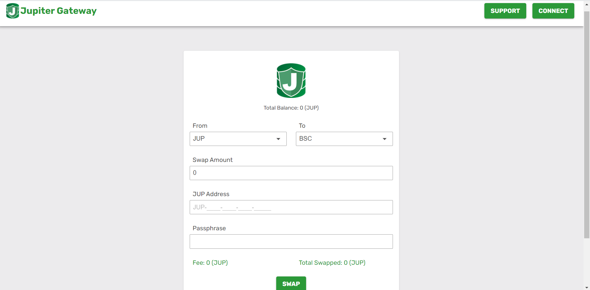

We want to swap from Mainnet to bwJup, so choose from **JUP** (1) to **BSC**(2). Next connect your wallet with the connect button upper right (3). Be sure to switch to the binance smart chain network and select the account you want your bwJUP to be sent to. This is important, as the swap frontend is taking the destination JUP-address from the entry-fields, but the destination bwJUP-address is the connected account!

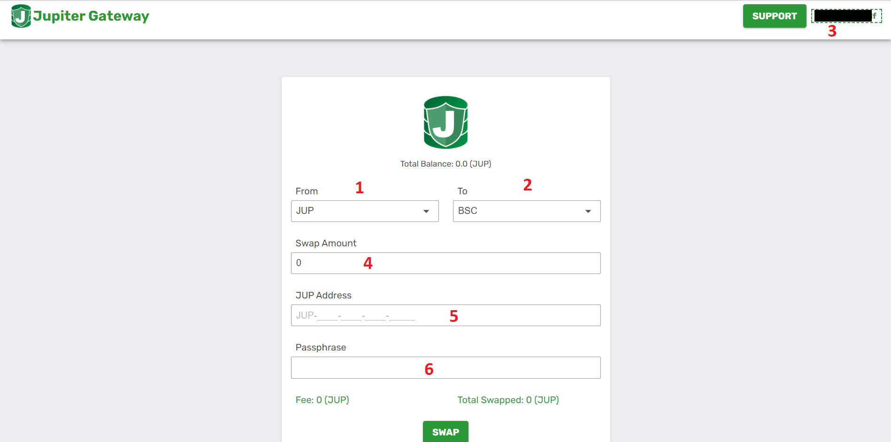

4.) Enter the amount you want to swap

5.) Enter your JUP-address from mainnet

6.) Enter the passphrase that you got, when you created your mainnet-JUP-address

**Now, important is, that you assure yourself, that your on swap.jup.io!** Because what is happening now, if you click swap?

The gateway will make an API-call to a jupiter-node and is creating a tx from your account with the amount you entered (it has your address and the passphrase to do so). It will create the tx with the mainnet-gateway address as receiver. Then the gateway will create a transaction on the binance smart chain. If you are not on the official frontend, you just sent someone your jup-address and the passphrase which means, your funds are most likely already in his wallet and not yours anymore. so be extra careful and check again if you are on the right page, if you have doubts.

There is no fee, as your account is paying the tx-fee for the mainnet and the gateway is covering tx-fee on BSC-side.

Click Swap!

After it is processed you can check the JUP [block-explorer](https://jupitertoolkit.com/explorer/blocks) if your tx was snet to the gateway. After a few minutes you should see the outgoing tx on the bs-chain on [bscscan bwJUP contract](https://bscscan.com/address/0x34fbbb37eb4f50f447e736e7b771bd3ad20c41ca#tokentxns). If not, wait 30 minutes and create a [Supportticket](#supportticket)

If the tx is there, you should see the coins in your wallet.

_________________________________________________________
## bwJUP or ERC20-JUP to Mainnet

**Gateway is automated**

There is a blog article on jupiter homepage: [Blog gateway procedures](https://blog.gojupiter.tech/gateway-procedures-update-7c6f29e422a). The announced automated gateway is live and makes swaps easier, however, here comes the guide how to swap and what you should keep in mind:

First head over to the new frontend [here](swap.jup.io)

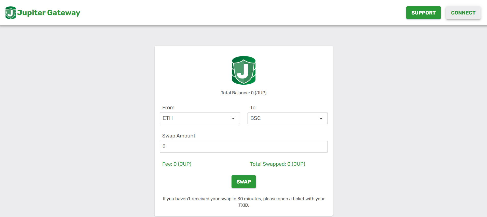

The next steps are basically the same if you want to swap from ETH or BSC to mainnet, just select the approriate from (1), select **JUP** as to (2) and connect your wallet with the account you wish to use (3).

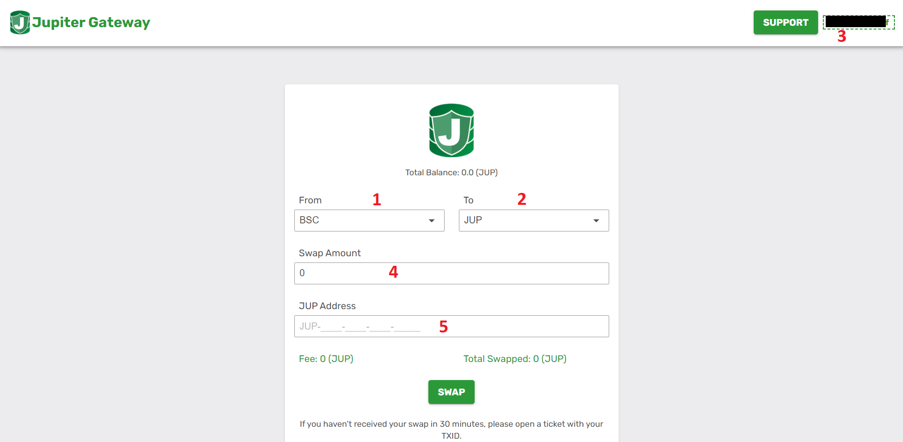

4.) Enter the amount you want to swap

5.) Enter you mainnet JUP-address. This can be either a newly created address, an address created in leda or an address created i metis.

You can now click swap and your wallet opens, where you have to confirm the tx.

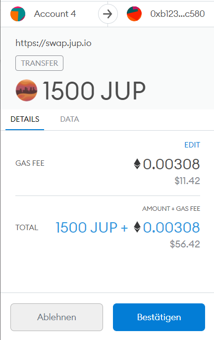

After that, your swap will be processed automatically. There is no fee, the tx-cost for mainnet-tx is covered by the gateway.

If you want to check, if your tx arrived at the gateway, look at [etherscan](https://etherscan.io/tokentxns?a=0xb123740aef4eb25b696fd9876B24F18AEce9c580&p=1) or [bscscan](https://bscscan.com/tokentxns?a=0xb123740aef4eb25b696fd9876B24F18AEce9c580&p=1).

For the outgoing tx on mainnet, you can check JUP [block-explorer](https://jupitertoolkit.com/explorer/blocks).

If your swap takes longer than 30 minutes, create a [Supportticket](#supportticket),

_________________________________________________________
## ERC20 JUP to bwJUP or bwJUP to ERC20

**this Gateway is automated** (again).

The trick here is, bsc is a copy from ETH (well, more or less). The good thing on that, your private key is the same on ETH as on BSC, so if you have an address on ETH, it is the same on BSC. This is the way how the automated gateway works. Incoming tx from the ETH-Network are sent out over BSC back to the same address you sent it on ETH-Network!

An example:

Somebody sent 46487 ERC20 JUP to the gateway (you notice the "IN").

Here, on BSC, the tx was sent out - to the same address!

So, how does it work?

There is again a blog entry for that: [new swap procedures](https://blog.gojupiter.tech/gateway-procedures-update-7c6f29e422a). We get the Gateway address from there: **0xb123740aef4eb25b696fd9876B24F18AEce9c580** (this is just for research in case of anything not working as expected).

So now, have a look at the frontend of the new gateway:

Let's start with the clean UI:

- Upper right you can connect your wallet (metamask, trustwallet)
- if connected, Total balance is updated with your ERC20-JUP or bwJUP balance.
- Swap Amount, where you enter the amount 
- From - To, select the swap direction
- Fee: If BSC to ETH is selected the fee is displayed (due to the super high fees due to the time of writing: 500 bwJUP)
- Swap button
- Info, when you should start wondering, why your swap is not done and you should create a [supportticket](#supportticket) ;)
- also upper right "support", which forwards you the the ticket creation page

------

### ERC20-JUP to bwJUP

so let's connect our metamask wallet:

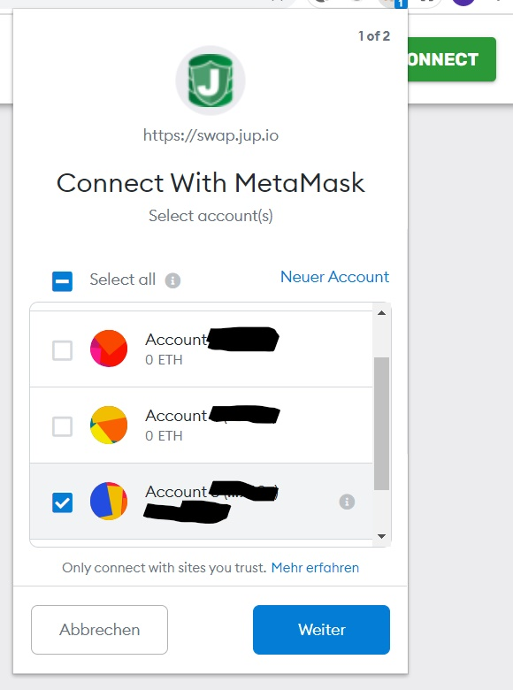

First, select the chain you want to send your coins from (example here is ETH). Click next and on the following screen click connect.

After that, the swap page should show your total balance. if not, click again on the address upper right. It switches now back to the "connect"-button. Click Connect-Button again. Now it should show the balance. This should also work, when you are switching between different addresses.

Now enter the amount you want to swap and check if direction is fine (in our case From: ETH, To: BSC)

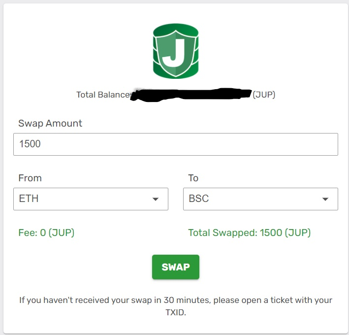

As you can see, there is no fee, as you are paying the fee on the ETH-side of the transaction and the gateway is paying for the BSC-side. 

Now click "swap". Your wallet opens and you need to confirm the transaction. By the time writing, gas was around 100 GWEI for a fast tx.

Click "Ok" and your swap will start :)

When it arrives at the gateway, it usually takes some minutes to process the swap. After it is sent out on the other chain, you receive your coins in your wallet.

------

### bwJUP to ERC20-JUP

**Gateway is automated**

so let's connect our metamask wallet:

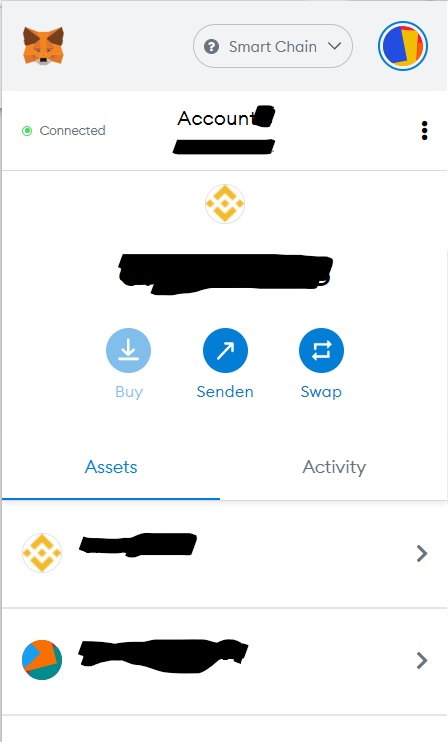

After that, the swap page should show your total balance. if not, click again on the address upper right. It switches now back to the "connect"-button. Click Connect-Button again. Now it should show the balance. This should also work, when you are switching between different addresses.

Enter the amount you want to swap and select direction From: BSC To: ETH

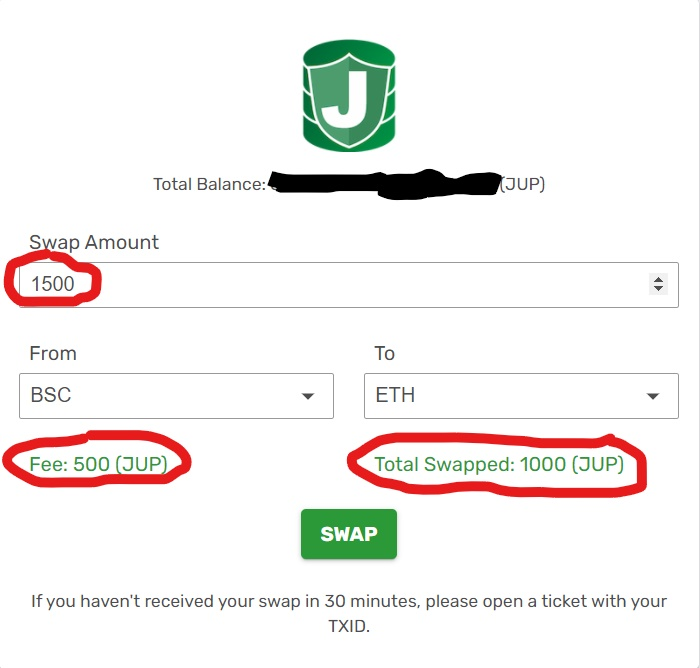

Notice amount, fee and  **total swapped - this is what will be sent to your address**

Now click "swap" and your wallet opens, where you need to confirm the tx:

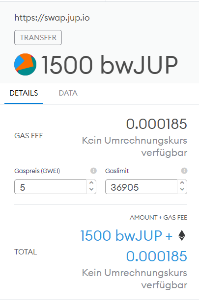

After you confirmed that, your swap will start :)

When it arrives at the gateway, it usually takes some minutes to process the swap. After it is sent out on the other chain, you receive your coins in your wallet.

_________________________________________________________
### One last note

On the first automated implementation, the BSC-Side was somewhat unstable. There is no experience yet, if it is the same with the new swap-gateway. But no worries, as long as you see your tx incoming on the block explorer of the network you sent it from - if ERC20 JUP [ETH](https://etherscan.io/address/0x34fbbb37eb4f50f447e736e7b771bd3ad20c41ca#tokentxns) or bwJUP [BSC](https://bscscan.com/tokentxns?a=0x34fbbb37eb4f50f447e736e7b771bd3ad20c41ca&p=1) - your funds are safe. They are logged on the gateway and can be processed manually - therefore open a ticket on [Jupiter homepage](https://gojupiter.tech/support/)

_________________________________________________________
### Supportticket

If you read the little advice on the buttom of the swap-page, please wait at least 30 minutes for the swap to be processed.

**If it takes longer than 30 minutes until your coins arrive, you can check on [bscscan](https://bscscan.com/tokentxns?a=0xb123740aef4eb25b696fd9876B24F18AEce9c580&p=1)  or [etherscan](https://etherscan.io/tokentxns?a=0xb123740aef4eb25b696fd9876B24F18AEce9c580&p=1) if your tx was sent.**

**If not, open a support ticket on the [Jupiter homepage](https://gojupiter.tech/support/) and enter some details like:**

- **your address**
- **the Network you are sending FROM**
- **the tx-id**

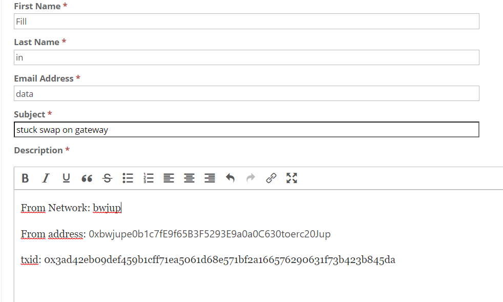

the tx-id can be found on:

- ETH: https://etherscan.io/address/0xb123740aef4eb25b696fd9876B24F18AEce9c580#tokentxns - search your transaction and copy tx-id
- BSC: https://bscscan.com/address/0xb123740aef4eb25b696fd9876B24F18AEce9c580#tokentxns - search your transaction and copy the tx-id
