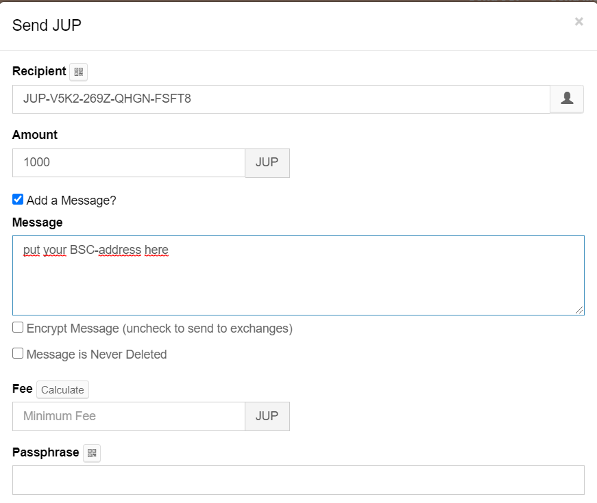
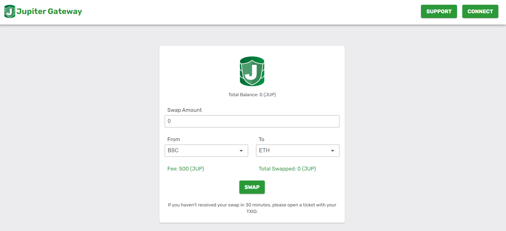

# Content

[Mainnet to bwJUP](#swap-mainnet-to-bwjup)

[bwJUP/ERC20 to Mainnet](#bwjup-or-erc20-jup-to-mainnet)

[General info about swaps between ETH and BSC](#erc20-jup-to-bwjup-or-bwjup-to-erc20)

[ERC20 to bwJUP](#erc20-jup-to-bwjup)

[bwJUP to ERC20](#bwjup-to-erc20-jup)

[Supportticket](#supportticket)

For all official info, click [here](https://blog.gojupiter.tech/gateway-procedures-update-7c6f29e422a).

_________________________________________________________
## Gateways to swap JUP between the different chains

as we all (should) know, Jup is available on 3 chains currently:

- native JUPChain (Mainnet, where the announced dApps will run)
- ETHChain as ERC20 JUP (a pitty, should be wJUP)
- BS-Chain as BEP20 bwJUP (binance wrapped Jupiter - yeah :) )

now, to swap your coins to the different chains, there are gateways in place. The purpose of this info is to show how you can swap, what costs you have and if it is manually or automated.

There are 5 possibilities currently:

- Mainnet to bwJUP
- bwJUP to Mainnet
- ERC20 to Mainnet
- ERC20 JUP to bwJUP
- bwJUP to ERC20 JUP

The possibility to swap Mainnet to ERC20 is not longer active, because of the high fees on ETH-Chain

_________________________________________________________
## Swap Mainnet to bwJUP

By the time writing, this is done manually.

There is a blog article on jupiter homepage: [Blog gateway procedures](https://blog.gojupiter.tech/gateway-procedures-update-7c6f29e422a). It is rather short but contains two important things:

-  **[JUP-V5K2-269Z-QHGN-FSFT8](https://jupitertoolkit.com/explorer/address/JUP-V5K2-269Z-QHGN-FSFT8)**. This is the gateway address for native JUP. So if you want to swap, send your JUP to this address 
- Where should the bwJUP be sent to? Put the address as a message into your tx

you have to tick "Add a Message?" to add your BSC-Address, calculate fee, enter your passphrase and good to go!

You can now head over to [jupitertoolkit explorer](https://jupitertoolkit.com/explorer/address/JUP-V5K2-269Z-QHGN-FSFT8) and see if your tx came in.

After it is processed (as said manually currently), you should see the outgoing tx on the bs-chain on [bscscan bwJUP contract](https://bscscan.com/address/0x34fbbb37eb4f50f447e736e7b771bd3ad20c41ca#tokentxns)

When the tx is there, you should see the coins in your wallet.

_________________________________________________________
## bwJUP or ERC20-JUP to Mainnet

This process is currently manual.

Send your coins to this address: **0x3162f7EA049E45595d6cF786FBE4Fc553AbE817F**.

Confirm [here](https://blog.gojupiter.tech/gateway-procedures-update-7c6f29e422a) on official blogpost if you want to be sure about the address.

After you sent the coins, contact @sigwo as soon as possible in telegram via dm and send him:

- your mainnet jup-address, where you want to receive your coins
- the tx-id of the transaction you just sent to the gateway address, so that sigwo can match it

_________________________________________________________
## ERC20 JUP to bwJUP or bwJUP to ERC20

this Gateway is automated (again).

The trick here is, bsc is a copy from ETH (well, more or less). The good thing on that, your private key is the same on ETH as on BSC, so if you have an address on ETH, it is the same on BSC. This is the way how the automated gateway works. Incoming tx from the ETH-Network are sent out over BSC back to the same address you sent it on ETH-Network!

An example:

Somebody sent 46487 ERC20 JUP to the gateway (you notice the "IN").

Here, on BSC, the tx was sent out - to the same address!

So, how does it work?

There is again a blog entry for that: [new swap procedures](https://blog.gojupiter.tech/gateway-procedures-update-7c6f29e422a). We get the Gateway address from there: **0xb123740aef4eb25b696fd9876B24F18AEce9c580** (this is just for research in case of anything not working as expected).

So now, have a look at the frontend of the new gateway:

Let's start with the clean UI:

- Upper right you can connect your wallet (metamask, trustwallet)
- if connected, Total balance is updated with your ERC20-JUP or bwJUP balance.
- Swap Amount, where you enter the amount 
- From - To, select the swap direction
- Fee: If BSC to ETH is selected the fee is displayed (due to the super high fees due to the time of writing: 500 bwJUP)
- Swap button
- Info, when you should start wondering, why your swap is not done and you should create a [supportticket](#supportticket) ;)
- also upper right "support", which forwards you the the ticket creation page

------

### ERC20-JUP to bwJUP

so let's connect our metamask wallet:

First, select the chain you want to send your coins from (example here is ETH). Click next and on the following screen click connect.

After that, the swap page should show your total balance. if not, click again on the address upper right. It switches now back to the "connect"-button. Click Connect-Button again. Now it should show the balance. This should also work, when you are switching between different addresses.

Now enter the amount you want to swap and check if direction is fine (in our case From: ETH, To: BSC)

As you can see, there is no fee, as you are paying the fee on the ETH-side of the transaction and the gateway is paying for the BSC-side. 

Now click "swap". Your wallet opens and you need to confirm the transaction. By the time writing, gas was around 100 GWEI for a fast tx.

Click "Ok" and your swap will start :)

When it arrives at the gateway, it usually takes some minutes to process the swap. After it is sent out on the other chain, you receive your coins in your wallet.

------

### bwJUP to ERC20-JUP

so let's connect our metamask wallet:

After that, the swap page should show your total balance. if not, click again on the address upper right. It switches now back to the "connect"-button. Click Connect-Button again. Now it should show the balance. This should also work, when you are switching between different addresses.

Enter the amount you want to swap and select direction From: BSC To: ETH

Notice amount, fee and  **total swapped - this is what will be sent to your address**

Now click "swap" and your wallet opens, where you need to confirm the tx:

After you confirmed that, your swap will start :)

When it arrives at the gateway, it usually takes some minutes to process the swap. After it is sent out on the other chain, you receive your coins in your wallet.

_________________________________________________________
### One last note

On the first automated implementation, the BSC-Side was somewhat unstable. There is no experience yet, if it is the same with the new swap-gateway. But no worries, as long as you see your tx incoming on the block explorer of the network you sent it from - if ERC20 JUP [ETH](https://etherscan.io/address/0x34fbbb37eb4f50f447e736e7b771bd3ad20c41ca#tokentxns) or bwJUP [BSC](https://bscscan.com/tokentxns?a=0x34fbbb37eb4f50f447e736e7b771bd3ad20c41ca&p=1) - your funds are safe. They are logged on the gateway and can be processed manually - therefore open a ticket on [Jupiter homepage](https://gojupiter.tech/support/)

_________________________________________________________
### Supportticket

If you read the little advice on the buttom of the swap-page, please wait at least 30 minutes for the swap to be processed.

**If it takes longer than 30 minutes until your coins arrive, you can check on [bscscan](https://bscscan.com/tokentxns?a=0xb123740aef4eb25b696fd9876B24F18AEce9c580&p=1)  or [etherscan](https://etherscan.io/tokentxns?a=0xb123740aef4eb25b696fd9876B24F18AEce9c580&p=1) if your tx was sent.**

**If not, open a support ticket on the [Jupiter homepage](https://gojupiter.tech/support/) and enter some details like:**

- **your address**
- **the Network you are sending FROM**
- **the tx-id**

the tx-id can be found on:

- ETH: https://etherscan.io/address/0xb123740aef4eb25b696fd9876B24F18AEce9c580#tokentxns - search your transaction and copy tx-id
- BSC: https://bscscan.com/address/0xb123740aef4eb25b696fd9876B24F18AEce9c580#tokentxns - search your transaction and copy the tx-id