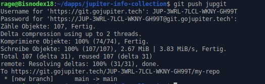
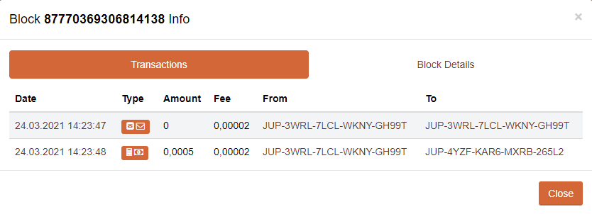
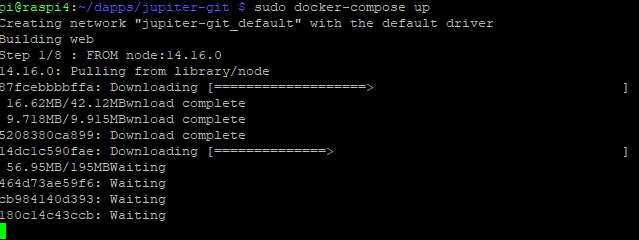

# Jupiter-git

Here is a small tutorial on how to install and use Jupiter-git.

Jupiter-git is a dApp, running on the Jupiter Blockchain that acts as git-server. This means, you are storing your repositories (basically every repo you want) on a Blockchain.

#### Use Cases:

- Storing your own repos decentralized. As long as one node is running, you can access it.
- Storing any other repo decentralized. As there is no central authority, they can't be deleted. Example would be the Exploit-PoC for the exchange-flaw that was deleted on Github (owned by Microsoft).

### just using jupiter-git with ressources of the dev-team (WiP)

The probably easiest way to use jupiter-git is. to use the already deployed git-server from the team.

The address is `git.gojupiter.tech`.

So to use it, all you have to do is to add this server as a remote server to your local git installation:

`git remote add jupgit https://git.gojupiter.tech/'your mainnet jupiter address'/my-repo`

`jupgit` is an alias, free to choose, for that server, so later, when you want to work with your repos you can simply use this name to tell git, where it should push your data to or pull it from.

After you have done that you can already start pushing your things to the blockchain :)

as an example, i cloned this repo you are just reading and pushed it onto the JUP-Chain.

As you can see, your JUP-Mainnet address is the username, the password you need is your passphrase (the 12-word seedphrase). You get this for example, when you create a new account on leda or over the webwallet.

That's it, you just pushed this repository to a blockchain.

Let's have a look, how this looks on the chain:

We have two transactions regarding that git push. The first one is a message, the second one is the payment. The message is administrative stuff, telling the git-server, which address the target is.

So you see, adding a small repository costs 0.0005 JUP.

### Installation of the jupiter-git-server as a container (WiP)

You can find Jupiter-git on [Github](https://github.com/whatl3y/jupiter-git).

First let's start with some dependencies for this tutorial. You need:

- docker
- docker-compose
- git

After you installed that you can clone the repository with:

`git clone https://github.com/whatl3y/jupiter-git`

Change to the directory `jupiter-git`

