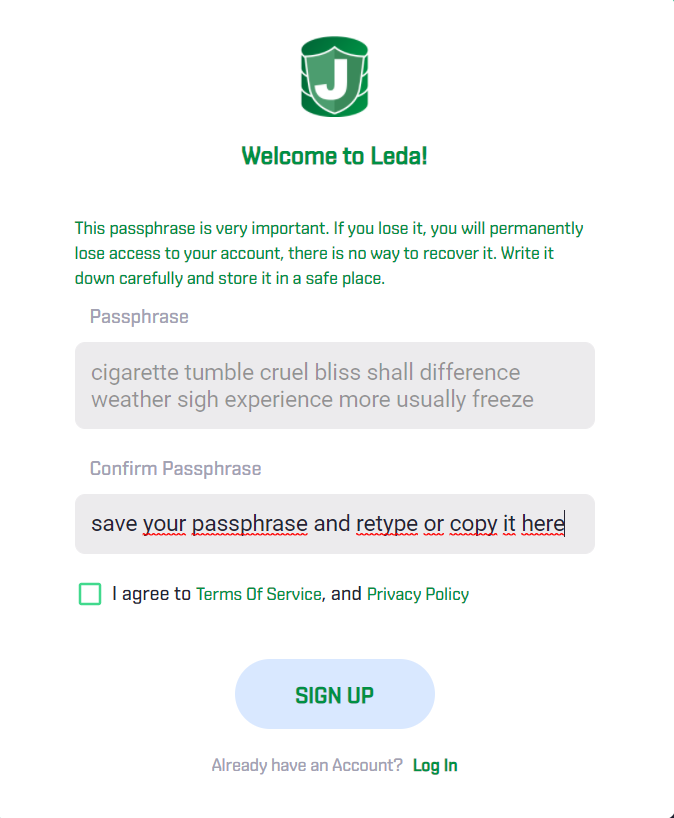

# LEDA - all about NFT

Leda will be Jupiters place for NFTs. Be it the marketplace or where you create your assets - here you go. It is running on the native Juniper Chain (not ETH, not BSC), so to use it, you need an account, some native JUP to play with and how to get this is in the following text.

## since you are now able to play around with a alpha-preview of Leda, here are some basics how to get started (most functions are currently not activated):

## Create account

Easy thing so.

Visit [leda page](https://leda.gojupiter.tech/) and click "register". Now a Passphrase is automatically generated. 

**Important**: Save this passphrase in a secure place. if you loose it or somebody else can get access to it, your funds on this account are gone!

After you backupped it, retype it (or then copy it, **after** you made a backup), tick that agreement and "sign up"

**Also important**: This passphrase is a real, unchanged passphrase, please do not reuse it anywhere!

And a last thing. This account is not just a leda-account, it is a standard jup account and you can use it for every Service!

wohoooo, that's it.

If you click now on "My Account" you will find your address and balance.

You can also set an additional name and a description

Enter your Passphrase (YES, exactly the one you backupped!) and click "Submit". What? you can't click Submit? Me neither...

Look at what is stated below "set account info":

**Your account is not active. Please have at least one transaction on Jupiter**

Ok, let's get us something to play to activate the account.

## Faucet for Mainnet

Community Member Voorsie created a faucet which will send you 1 JUP. Let's grab it.

For that you need to go to the [Jupiter Telegram group](https://t.me/jupiterproject). The access to the Faucet is restricted to prevent abuse. If you tag Sigwo, Voorsie or Letstrythis, ask for JUP from the Faucet and add your Jupiter address, they will most probably send it to you.

So, the faucet payment was triggered.

and it arrived on our address already.

If you need to activate the account in the future, you may look here for a short info, how to send native JUP via the [webwallet](https://github.com/raetsch/Jupiter-Info-Collection/blob/main/wallets/native_wallet.md)

Let us now have a look at our account we used to login for leda...

**Currently the status is alpha and "MyAccount" seems not to work properly. More infos will be added later**

## Watch Marketplace

Just simply click on Marketplace and search for NFTs you like

## Create NFT

If you click on "Create NFT", you can... create your NFT :)

Simply choose the file, enter a name for the NFT, think about quantity and price, add additional tags and enter your passphrase (hihi). and click "Create NFT".

**Be careful, in this alpha-version, your passphrase is not hidden and visible in clear text**

Basically that's it, your first own NFT!

and if you look at the Block Explorer:

There we go.

You can also find it on the Marketplace in the Jupiter Wallet:

and if you specify one of your tags (ugly), you find it with some more details

