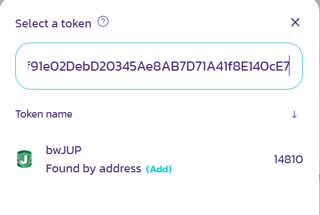

## Content

[Farming on ETH](#farming-on-eth-chain)

[Providing Liquidity on Pancakeswap](#providing-liquidity)

[Liquidity Farming on valuedefi (bwjup)](#liquidity-farming)

[Single side staking on valuedefi (bwjup)](#single-side-staking-on-bsc)

## Farming on ETH-Chain

Farming on Jup(ERC20) is possible via farm on unicrypt

The devteam created a youtube video, so no need for a wall of text or pictures :)

It just has the original logo introduced:

[Buy, provide Liquidity and farm JUP](https://www.youtube.com/watch?v=9UMw3Q5R77w)

## Providing Liquidity and Farming/Staking on BS-Chain

#### Providing Liquidity

 You need to provide liquidity on the JUP/BNB-Pool Version 2 on [Pancakeswap](https://pancakeswap.info/token/0x0231f91e02debd20345ae8ab7d71a41f8e140ce7)

Don't worry if something like "The data on this site has only synced to Binance Smart Chain block 4917536 (out of 5497233). Please check back soon." appears on top of the side. It basically means that data is not accurate in this view, however the information of the jupitertoolkit bot is:

If you want to provide liquidity or trade, click the buttons on the right.

The bwJUP-Contract address is [0x0231f91e02debd20345ae8ab7d71a41f8e140ce7](https://www.bscscan.com/token/0x0231f91e02debd20345ae8ab7d71a41f8e140ce7)

If you click on "add Liquidity" the swap-app is loading and you should see this window:

Check the contract-address and then click "understand" and "Continue".

You are here then:

Now is a good time to select the right wallet-address. Open metamask (or any other suitable wallet) and select the account you have your BNB and bwJUP in, if it is not already selected.

The main thing on liquidity is, you have to provide the same value of both coins. If you put in 100$ of BNB, you need to add also 100$ of bwJUP.

Wait, on the screenshot above, there is no bwJUP selected, so lets add it:

 

No bwJUP appears... if it does, select it, if not, put in the contract-address:

Now select it. 

As said, you need to add the same amount. The App automatically calculates the amount needed for the second token, if yo enter an amount on one of them:

Here 0.1 BNB were put in and the system calculated 823.347 bwJUP. When you decided what you want to add, click "Supply", but remember, you need to have some small amount of BNB left to pay for the transactions.

The number you see here is the Pool-Token. This is what you get in your wallet for providing the liquidity. Later, on a farm, you need to input these tokens. For now, you will just find that amount in the list of liquidity-providers on bscscan (we will see later). Click "Confirm Supply" and your wallet (here Metamask) should open up:

This is the transaction that sends the tokens into the pool, click confirm and wait till it is done.

If it is not confirm supply but approve bwJUP, confirm it also and then you need to confirm supply after that .

When the transaction is done, you should find your amount of pool tokens you saw above in the contract for [PancakeSwap Liquidity Provider (LP) token](https://bscscan.com/token/0x6c7cdffa997f46598b9616bc0481372e45a00dc4#balances) that represents the bwJUP/BNB-Pool.

#### Liquidity Farming (Value.defi maybe still active but not recommended, due to security risk)

Remember, when you provided liquidity, you got that information, how many BNB/JUP-Pool Tokens you got:

Now this Coins can be put into a farm to earn more rewards:

[farm on valuedefi.io](https://bsc.valuedefi.io/#/vfarm/0x810e10df4465b7751d75e961acaf0d06aaae11e1)

If you have Cake-LP in your wallet, you can simply add them by clicking on stake, enter the amount you want to add (usually max) and then click stake:

If it is your first time you add Cake-LP you have to approve the transaction:

after you approved it, you can click on stake and have to confirm the transaction, that sends your Cake-LP into the farm.

After that, you are clear and can claim rewards:

Every time you want to claim your rewards, it is another transaction from the farm contract to your wallet.

#### Single side staking on bsc (Value.defi maybe still active but not recommended, due to security risk)

______________________________________________________________________________________________________________________________________________________________________________________________________________________________________________________________

If you want to stake your Jup, you can do that now on bsc, following this link:

https://bsc.valuedefi.io/#/vfarm/0xfe4a47a3bf9a9912f8b9f3706e3f5328df9e3a39

It is now no longer needed to provide liquidity to get rewarded. If you choose to stake via valuedefi, follow the next steps:

If you open the link you might see the following window, if you do not have a bsc-address connected:

The wallet you choose should contain bwJup (and that will be sent to the staking contract)

Now click on stake. A window pops up, where you can select how much Jup you want to stake. Click approve then.

Your wallet should now open (for me Metamask). Click on confirm to approve your bwJup. This should not take long, no need to change the fee here.

When your transaction is confirmed, you should see the "stake"-button. Click it.

Again Wallet opens and now you are confirming the transaction into the staking contract. Also there is no need to adapt the tx-fee. After the confirmation it is possible that you still see that window above (the stake-window). Just close it. 

If this is done, you see your pool share (and also APR)

If not, just reload the page.

That's it. You should already receive the first JUP :)

Some words to the shown values:

- APR - shows a rate per year, depending on price of Jup, share of your stake. It get's updated frequently, that is why it is tagged "unstable"
- MY pool share - Yes, your amount of the pool in relation to every Jup in the farm. This is updated if you (or someone else) adds or removes Jup from the farm
- Estimated my share - Your amount of Jup multiplied with the current price (not sure how accurate and where the price info comes from)
- Balance not staked yet - the amount of Jup in your current connected wallet (which is obviously not in the farm)