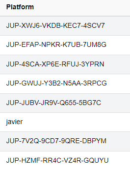

# Jupiter reward program

[TOC]

Jupiter offers a reward program for users on mainnet. To be eligible to get this rewards, there are 2 possibilities:

- buy and hold FORGE-asset
- run a node and hold JUP there

This program is the successor of the staking farms on BSC and FORGE can be seen as single side staking.

The rewards of 3000JUP are paid hourly and are calculated in the following way:
$$
reward per hour= 3000 /(All FORGE + All JUP on Nodes * 1.2) * (Your JUP * 1.2 + Your FORGE )
$$
 

As you can see, all FORGE, that is bought by users and all JUP that is on nodes, that are part of the reward program, is summed up. As a node has monthly costs, the JUP gets an additional weight of 20%. 

## FORGE

FORGE is an Asset on the Jupiter-Chain. Assets have IDs which make them unique, so first warning here:

**Everyone can create an asset called FORGE, but only the asset with the ID: 15210174725739850610 (confirm this in the official [blogpost](https://blog.gojupiter.tech/how-to-earn-on-jupiter-2108413fd0ad) to be sure) is usable to enter the Jupiter Earn Program**

So, were can you find it?

Go to your Jupiter Wallet (or Webwallet, for example [official webwallet](https://nodes.gojupiter.tech/index.html)) and click on asset exchange, then on "add asset". Enter the ID and click the green "add asset".

You should see now this:

What do we have here?

- 1.000.000.000 FORGE were created. 
- Exchange rate FORGE - JUP is 1:1 in both directions

### Buy FORGE

If you want to buy FORGE with your JUP, Click on the green "+". This opens the buy window, enter your amount and click "buy".

Another warning for security reasons:

**If you are <u>not</u> connected to a local wallet under your control (no, your VPS is also unsafe if you are not using tls-based encryption for the wallet), don't send your passphrase. It will be send over half the internet in clear text! Be sure that you use a wallet with encryption activated**

 

Wallets you can consider safe:

- [official webwallet](https://nodes.gojupiter.tech/index.html)
- a webwallet of a node, running in your local home network (except you think, your home network is not safe ;) )

Now opens a normal transaction dialogue where you have to enter your passphrase (the 12 words - with spaces).

If you click on "Buy Asset" now, you get a short message on the upper right that your order was submitted. Now Click on forge again.

 

and you will see the buy order:

This will only take some seconds to a few minutes. When the bot bought your offer, it looks like this:

**That was everything you need to do. With holding FORGE on your address, you will get rewards on the next hourly payout**

### Selling FORGE for JUP

If you want to stop being part of the forging pool or at least want to remove a part of your share, you can sell FORGE for JUP.

This will remove your weekly rewards but cause no other penalties.

So to get your JUP back, simply go the the Asset Exchange and click the red "+". It is also 1:1, you do not lose anything, no fees, nothing.

It is bascially the same as on the buy-process. The difference is, that the sell orderbook is checked every 30 minutes by a bot.

That means, your sell order is processed at best in seconds and worst in 30 minutes.

## Run a node 

**This has nothing to do with the process of forging (supporting the network by creating blocks)**

So you can run a node and get rewards without actively forging, but you can also activate it, it does not harm your rewards :)

### Set up a node

If you want to setup a node, please use this guide, it should cover everything necessary to get a node running and take part on the reward program:

[node manual v2.2](https://github.com/raetsch/Jupiter-Info-Collection/blob/main/Jupiter manual V2.2 draft 30052021.pdf)

In the config-file you added a parameter called nxt.myPlatform and your JUP-address. This address is shown here:

All this address are part of the reward program (can be seen under peers in the wallet or on [galileo - jup stats page](https://stats.jup.io/peers)). So you need to have your JUP, that you want to use to take part on the reward program on that address. Balance leasing is not working here, this is only for the process of forging it self.

So as example, if you have 100k JUP on your reward-address and 100k JUP on another address and you are leasing this balance to address one:

- the reward program is paying out for 100k JUP
- for forging, your balance is 200k JUP

If you entered a wrong address in the node config, you need to enter the correct address and restart the node.

**Be aware that you are only getting rewards, if your node is on the peerlist of [galileo - jup stats page](https://stats.jup.io/peers). If it is not listed there, you do not get rewards. The reasons for that can vary and you should enter the [telegram group](https://t.me/jupiternodes) and ask for help :)**