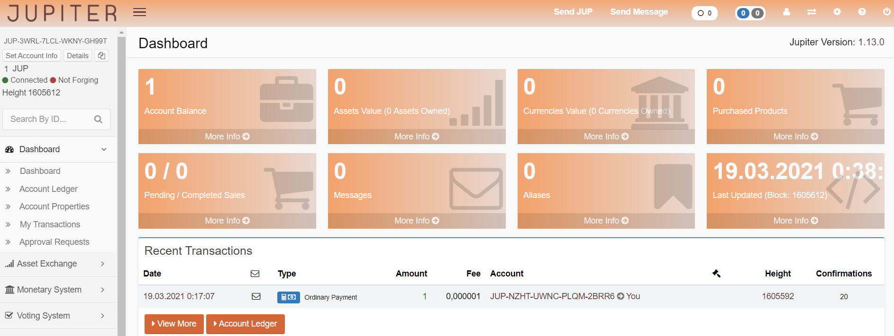
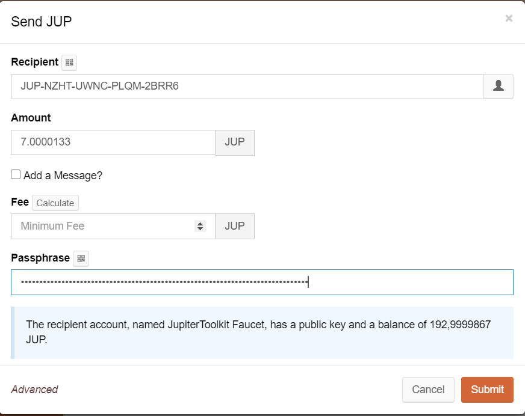

# Jupiter Core Wallet

Jupiter has a native wallet for accessing the Jupiter-Chain. In fact it is a web-wallet that connects to nodes, either somewhere in the web or on a locally running node.

For a quick start and to show how to send JUP, here is a quick tutorial.

Connect to a web-wallet, for example https://jpr2.gojupiter.tech/. By the time of writing, the native wallet still sticks to the old colour-scheme (Jupiter-red).

You can now decide if you want to register or already have an account (for example you created one for Metis or Leda).

We select "returning user".

Enter your JUP-address. Click on the arrow and you are logged in. This is a read-only mode. If you want to do something you need to enter your passphrase then, but more later.

We want to send our JUP around, so click "Send JUP" in the upper bar.

In the opened window, enter the recipient, the amount, if you want to add a message, tick it and add your message. 

Enter your passphrase (yes, again) and beware of trailing spaces when you copy it ;)

That message below the passphrase shows some info. For example, if you are sending to a new account, the message is like:

*This account never sent a transaction, provide public key to add security*

This is just for you to be sure, you are sending to the right address.

Click submit and that's it.

You just sent out your first native JUP(s)!

